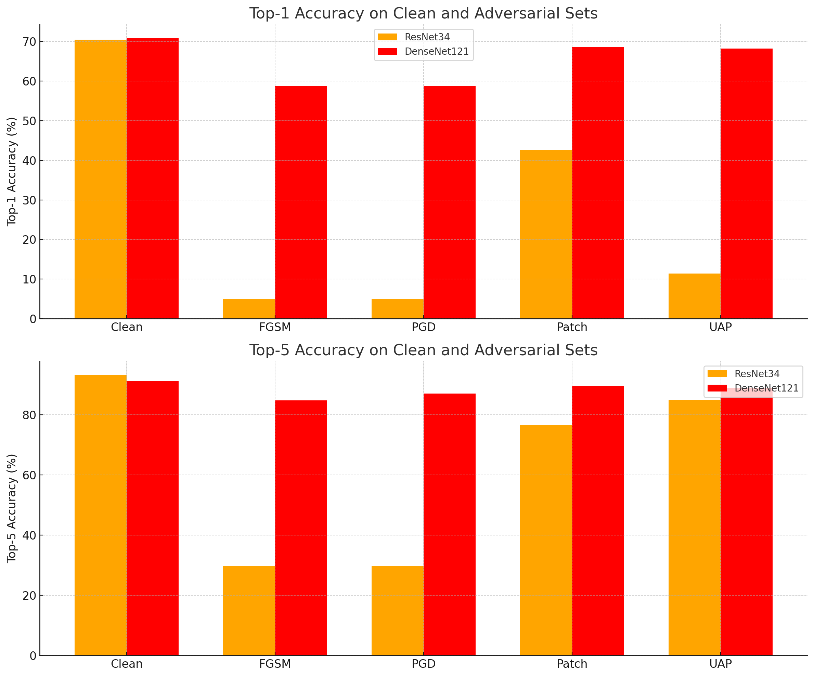

# Adversarial Attacks on Neural Nets.

This repository contains the Python code (written in the Jupyter Notebook) for the 

1. ResNet34 model trained on ImageNet1K V1 dataset.
2. The FGSM (Fast gradient sign method) attack on the  ResNet34 model with epsilon 0.02.
3. The PGD (projected gradient descent) attack on the ResNet34 model with epsilon 0.02.
4. Universal Adversarial Perturbation using Deepfool method with the maximum pixel deflection 0.02
5. The patch attack using our best method (PGD) for a patch size of 32 X 32 pixels.
6. Transfer attack on DenseNet121 from the ResNet34 trained on ImageNet1K V1 dataset for the 2, 3, 4, and 5. attacks.

## The Dataset
The dataset is the zip file TestDataSet.zip. It contains the 100 class labels for ImageNet1K V1. 

## Infrastructure 
The IPython notebook was run on a P100 GPU in the Kaggle / Google Colab Accelerators. 

# Results
The results are summarized in the report (submitted in the gradescope). The quick overview of the results can be found below. 

